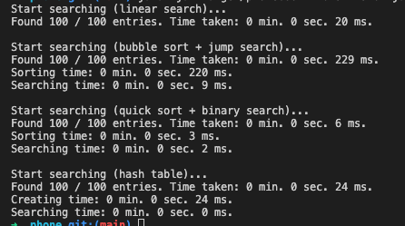

# PhoneBook

It's my project to learn sorting and searching algorithms.
Program reads files with phones directory and names to find. Then it sorts directory using bubblesort and quicksort algorithms and searches necessary phones in sorted directory using jumpsearch and binarysearch.


# Usage:

Compile and build package project with Maven:
```
$mvn clean compile
$mvn package
```
Run project:
```
$java -jar target/phonebook-1.0-SNAPSHOT.jar
```

The program sorts and searches using different algorithms and then compares the execution time of the algorithms:



!If files too big and sorting too long program sorts directory by Collections.sort(dir).
